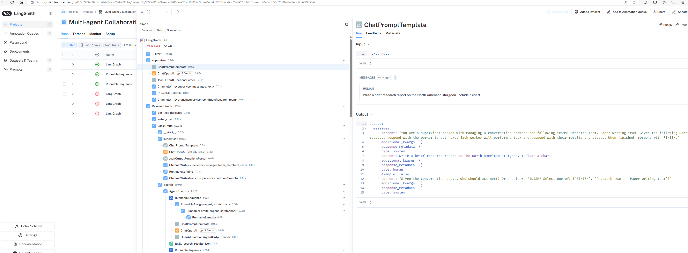

# langGraph: https://blog.langchain.dev/langgraph-multi-agent-workflows/
langgraph experiment

Create a virtual environment :
```bash
python -m venv .venv
.\.venv\Scripts\activate
```
Install dependencies
```bash
pip install -U langgraph langchain langchain_openai langchain_experimental bs4 matplotlib
```

