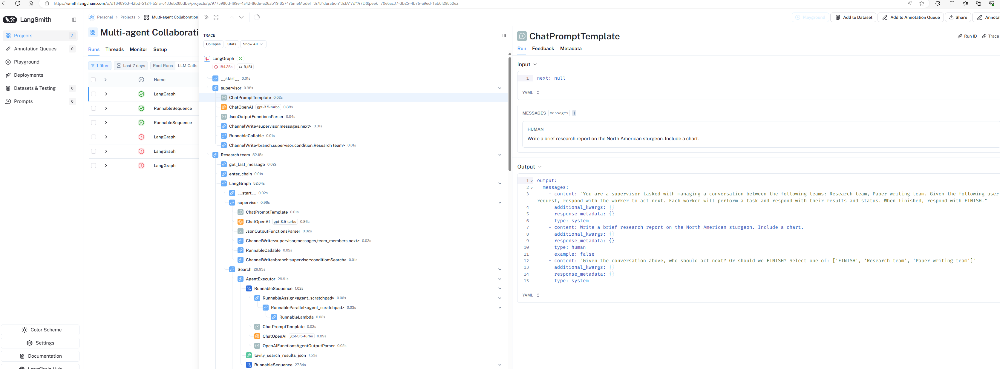
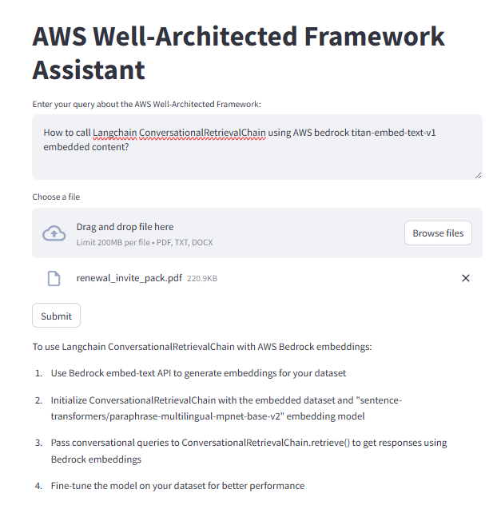

# langGraph: https://blog.langchain.dev/langgraph-multi-agent-workflows/
langgraph experiment

## Setup (uv)

This project uses [uv](https://docs.astral.sh/uv/) for environment and dependency
management. Dependencies are declared in `pyproject.toml` and pinned in `uv.lock`
(targeting the LangChain/LangGraph 0.3.x line on Python 3.12).

```bash
# Install Python 3.12 (uv manages the interpreter) and sync the locked env
uv python install 3.12
uv sync

# Run the Streamlit app
uv run streamlit run app.py

# Run any script in the project env
uv run python langgraph_researcher_example.py
```

A generated `requirements.txt` is also exported from the lock for tooling that
needs it (`uv export --no-hashes --no-dev -o requirements.txt`).



